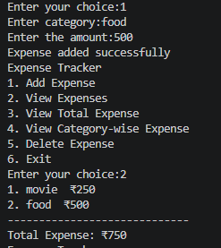

# 💰 Expense Tracker

A simple command-line Expense Tracker built using Python. This application allows users to record, view, organize, and manage their daily expenses through a menu-driven interface.

## 🚀 Features

- ➕ Add a new expense
- 📋 View all expenses
- 💵 Calculate total expenses
- 📊 View category-wise expense totals
- 🗑️ Delete an expense
- 🚪 Exit the application

## 📂 Data Structure

The application stores expenses using a **list of dictionaries**.

Example:

```python
expenses = [
    {"category": "Food", "amount": 250},
    {"category": "Travel", "amount": 120},
    {"category": "Shopping", "amount": 500}
]
```

## 🛠️ Concepts Used

- Python Functions
- Lists
- Dictionaries
- Loops
- Conditional Statements
- User Input
- List Operations (`append`, `pop`)
- Dictionary Operations
- `enumerate()`
- Menu-Driven Programming

## ▶️ How to Run

1. Clone the repository.

```bash
git clone https://github.com/your-username/expense-tracker.git
```

2. Navigate to the project folder.

```bash
cd expense-tracker
```

3. Run the program.

```bash
python expense_tracker.py
```

## 📷 Sample Output

```
Expense Tracker

1. Add Expense
2. View Expenses
3. View Total Expense
4. View Category-wise Expense
5. Delete Expense
6. Exit

Enter your choice:
```

## 📌 Future Improvements

- Save expenses to a file
- Load previous expenses automatically
- Add date and time for each expense
- Search expenses by category
- Monthly expense reports
- Expense visualization using charts
- Exception handling for invalid inputs

## 📷 Demo


